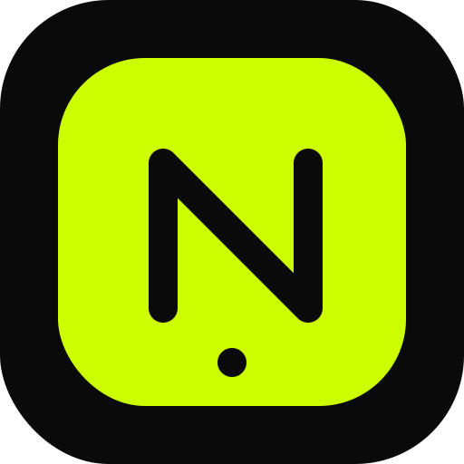

# 🌟 NeoLingua - Modern Urban English Tutor

<div align="center">
  
  <p><strong>Master modern urban English with AI-powered personalized lessons</strong></p>
  <p>
    <a href="#features">Features</a> •
    <a href="#quick-start">Quick Start</a> •
    <a href="#deployment">Deployment</a> •
    <a href="#pwa">Install as App</a>
  </p>
</div>

---

## ✨ Features

- 🎯 **8-Level Learning Path** - From Urban Newbie to Urban Legend
- 🤖 **AI-Powered Lessons** - Personalized content generated by Gemini AI
- 🎙️ **Interactive Podcasts** - Real-world conversations with context
- 📚 **Vocab Vault** - Save and review your favorite words
- 🏆 **Badge System** - Unlock achievements as you progress
- 💬 **Live AI Chat** - Practice conversations in real scenarios
- 📱 **PWA Support** - Install as a native app on mobile
- 🌐 **Offline Mode** - Learn anytime, anywhere

---

## 🚀 Quick Start

### Prerequisites
- Node.js (v20+)
- Gemini API Key ([Get it here](https://makersuite.google.com/app/apikey))

### Run Locally

1. **Install dependencies:**
   ```bash
   npm install
   ```

2. **Set up environment variables:**
   Create a `.env.local` file:
   ```env
   VITE_GEMINI_API_KEY=your_gemini_api_key_here
   ```

3. **Start dev server:**
   ```bash
   npm run dev
   ```

4. **Open browser:**
   - Local: http://localhost:3000
   - Network (mobile): http://YOUR_IP:3000

---

## 🌐 Deployment

### Deploy to Vercel (Recommended)

[](https://vercel.com/new/clone?repository-url=https://github.com/samantha-blablabla/NeoLingua)

**Manual deployment:**

1. **Push to GitHub:**
   ```bash
   git push origin master
   ```

2. **Import to Vercel:**
   - Go to [vercel.com](https://vercel.com)
   - Click "New Project"
   - Import this repository
   - Framework: **Vite** (auto-detected)

3. **Add Environment Variable:**
   - Key: `VITE_GEMINI_API_KEY`
   - Value: Your Gemini API key

4. **Deploy!** 🎉

For detailed deployment instructions, see [DEPLOY.md](DEPLOY.md)

---

## 📱 Install as App (PWA)

### Android (Chrome/Edge)
1. Open the deployed website
2. Tap menu (⋮) → **"Add to Home screen"**
3. App appears on home screen!

### iOS (Safari)
1. Open the deployed website
2. Tap Share button (↑)
3. Select **"Add to Home Screen"**
4. App appears on home screen!

**PWA Features:**
- ✅ Fullscreen experience (no browser UI)
- ✅ Custom app icon
- ✅ Splash screen
- ✅ Offline support
- ✅ Works like a native app

---

## 🛠️ Tech Stack

- **Frontend:** React 19 + TypeScript
- **Build Tool:** Vite
- **Styling:** Tailwind CSS
- **Animations:** Framer Motion
- **AI:** Google Gemini API
- **PWA:** Service Workers + Manifest

---

## 📂 Project Structure

```
NeoLingua/
├── components/          # React components
│   ├── BadgeGallery.tsx
│   ├── UrbanChat.tsx
│   └── ...
├── services/            # API & business logic
│   ├── geminiService.ts
│   ├── speechService.ts
│   └── badgeService.ts
├── public/              # Static assets
│   ├── manifest.json
│   ├── sw.js
│   └── icons/
├── App.tsx              # Main app component
├── types.ts             # TypeScript interfaces
├── lessons.ts           # Lesson data
└── index.html           # Entry point
```

---

## 🎨 Customization

### Change Theme Colors
Edit `index.html` and `manifest.json`:
```css
--primary: #CCFF00;  /* Neon Yellow */
--background: #0A0A0A;  /* Dark Black */
```

### Add Custom Lessons
Edit `lessons.ts` or let AI generate them via `geminiService.ts`

### Modify Learning Path
Update `ROADMAP_STEPS` in `App.tsx`

---

## 📄 License

This project is open source and available under the MIT License.

---

## 🤝 Contributing

Contributions welcome! Feel free to:
- Report bugs
- Suggest features
- Submit pull requests

---

<div align="center">
  <p>Built with ❤️ using Claude Code</p>
  <p>
    <a href="https://github.com/samantha-blablabla/NeoLingua">⭐ Star on GitHub</a>
  </p>
</div>
